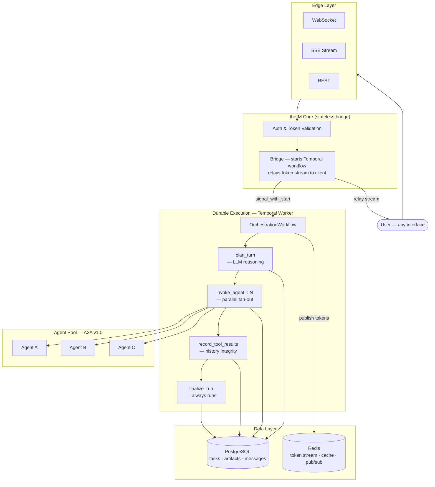
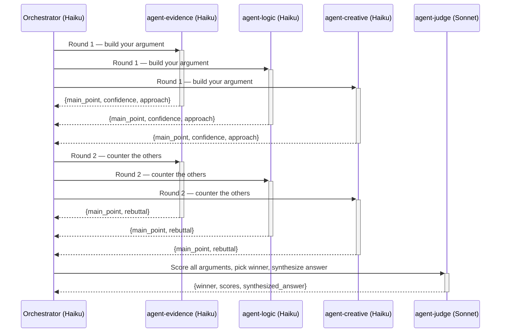

<div align="center">
  

  <h1>the-M</h1>
  <p><strong>Durable Multi-Agent Orchestration Platform</strong></p>
  <p>
    Compose teams of AI agents. Define what each one does.<br/>
    Let the LLM decide — in parallel, across turns, with full durability.
  </p>

  <p>
    
    
    
    
    
    
    
  </p>
</div>

---

## The Problem

Most AI agent frameworks focus on building a single agent. Real-world tasks require **teams of specialists** — a researcher, a coder, a critic, a data analyst — working in concert.

Coordinating multiple agents introduces hard problems:

- **Who decides which agent to call?** Static pipelines break when requirements vary.
- **What happens when a call fails mid-run?** In-memory state is lost on any crash.
- **How do you scale across replicas** without duplicating work or losing history?
- **How do you expose these workflows** to different clients — chat, voice, REST, SSE?

**the-M** solves all of these. It is an orchestration layer that sits above your agents, not inside them.

---

## What is the-M?

**the-M** is a production-grade multi-agent orchestration platform. It gives an LLM a registry of AI agents as callable tools, then runs a durable agentic loop — planning, parallel execution, result synthesis — across any number of turns.

Every run is a [Temporal](https://temporal.io/) workflow: crash-proof, auditable, and resumable. The orchestration layer is fully stateless — any replica can serve any connection, and a mid-run restart loses nothing.

Agents communicate via the [Google A2A v1.0 protocol](https://google.github.io/A2A/), a vendor-neutral HTTP standard. Any A2A-compatible service can join the agent pool without touching orchestration code.

---

## How It Works



### The Agentic Loop

Each run executes inside a Temporal workflow. The LLM is the planner; agents are the executors.

```
OrchestrationWorkflow
  ├─ load_orchestration_context  ← config, agent list, prior conversation history
  ├─ init_run                    ← create run + root task in Postgres
  │
  └─ loop (≤ max_iterations)
       ├─ plan_turn              ← LLM decides which agents to call; streams tokens to client
       ├─ invoke_agent × N       ← parallel A2A calls, bounded by max_parallel_tools
       ├─ record_tool_results    ← persist tool results so multi-turn history stays valid
       └─ summarize_context      ← rolling summary injected into future agent calls
  │
  └─ finalize_run                ← always runs; completes run record, writes Final Answer artifact
```

The bridge is a thin relay — it authenticates the connection, starts the workflow, and pipes the Redis token stream back to the client. All orchestration state lives in Temporal and Postgres.

---

## Key Design Decisions

### Durability via Temporal

Orchestration state is never held in process memory. Temporal's workflow model guarantees:

- **Crash recovery** — a worker restart replays the workflow from the last checkpoint
- **Exactly-once activity execution** — retries are idempotent; DB writes are keyed by sequence number
- **Cancellation with correct semantics** — stop button sets `status=canceled`, not `failed`
- **HITL pause/resume** — a workflow can block on a human signal indefinitely without consuming resources

### Stateless Bridge, N Replicas

Because all state is in Temporal + Postgres + Redis, the bridge process holds nothing. Any replica can serve any WebSocket connection. Scaling is `docker compose --profile replica up -d them-bridge-2` — no sticky sessions, no coordination.

### A2A Protocol — Pluggable Agent Pool

Agents implement the [Google A2A v1.0](https://google.github.io/A2A/) HTTP protocol. The platform:
- Fetches and caches agent cards (capability declarations)
- Routes typed JSON or plain-text inputs based on declared `input_modes`
- Handles async submit → poll/stream lifecycle transparently
- Deduplicates streaming artifact chunks

New agents are registered via the admin UI or API. No orchestrator code changes required.

### Multi-Turn History with Integrity Guarantees

Every message in a conversation is persisted to `task_messages` in Postgres:

```
Turn N root task:
  seq=0  user message
  seq=1  assistant turn  [tool_use blocks]
  seq=2  tool results    [tool_result blocks, 1:1 with seq=1]
  seq=3  assistant final answer
```

On the next turn, history is reconstructed from Postgres and passed through a full-pass sanitizer that drops any orphaned `tool_use`/`tool_result` pairs — preventing the Anthropic API `400` error that otherwise occurs when a prior run was interrupted mid-iteration.

### Context-Aware Compaction

Long-running orchestrations with verbose agents grow the LLM context window exponentially. the-M addresses this at two levels:

- **Tool result compaction** — JSON responses are reduced to routing fields only (`main_point`, `confidence`, `approach`, `winner`…); full content is stored in artifacts
- **Assistant turn slimming** — heavy nested argument arrays are stripped from tool_use blocks stored in `self.messages`
- **Rolling summary** — a background activity summarizes recent agent outputs and injects the summary into future agent inputs

---

## Feature Set

| Category | Capability |
|---|---|
| **Orchestration** | LLM-driven agentic loop, configurable `max_iterations`, token budget enforcement |
| **Execution** | Parallel fan-out via `asyncio.gather`, per-agent concurrency limits, durable Temporal activities |
| **Agent protocol** | Google A2A v1.0 — async submit, SSE/poll streaming, push webhooks, typed JSON parts |
| **Durability** | Crash recovery, idempotent retries, run history in Postgres, HITL pause/resume |
| **Multi-turn** | Full conversation history reconstructed from DB; context threads across reconnects and replica changes |
| **Memory** | Rolling LLM-generated summary injected into agent inputs across turns |
| **Edges** | WebSocket, SSE, REST fire-and-forget — same orchestrator behind every transport |
| **Applications** | Named entry points bind an orchestrator to an edge; public or token access policy |
| **Security** | JWT auth, bearer tokens with expiry, per-user rate limiting, ownership isolation, TOCTOU-safe scope checks |
| **Observability** | Real-time trace tab, task graph, artifact browser, per-turn token + cost tracking, Temporal UI |
| **Admin** | Agent registry CRUD, agent card discovery + diff, orchestrator config, access token management |

---

## Debate Stack — Example: Structured Multi-Agent Reasoning

The debate stack is a production example of what the-M makes easy to build.

Four specialized A2A agents debate any proposition across two rounds, then a judge synthesizes a verdict:



All three argument agents run in parallel each round. Full argument text is preserved in Postgres artifacts; only summary fields flow through the orchestrator's context window — keeping LLM cost flat regardless of argument length.

---

## Roadmap

| Status | Item |
|---|---|
| ✅ Done | Durable execution via Temporal |
| ✅ Done | A2A v1.0 agent protocol |
| ✅ Done | Multi-turn conversation history |
| ✅ Done | Parallel fan-out + context compaction |
| ✅ Done | HITL pause/resume via Temporal signals |
| ✅ Done | SSE + WebSocket pluggable edges |
| ✅ Done | Session resume in playground UI |
| 🔄 Planned | WebRTC edge (real-time voice) |
| 🔄 Planned | Swarm execution mode (agents spawning sub-agents) |
| 🔄 Planned | Visual workflow builder |
| 🔄 Planned | Agent marketplace / discovery index |
| 🔄 Planned | Cost-aware routing (cheapest capable agent wins) |
| 🔄 Planned | Evaluation harness for agent quality benchmarking |

---

## Stack

| Layer | Technology |
|---|---|
| Durable orchestration | Temporal 1.x · `temporalio` Python SDK |
| API & edges | Python 3.13 · FastAPI · asyncpg · SQLAlchemy async |
| Auth | Python 3.11 · FastAPI · bcrypt · JWT HS256 |
| Reverse proxy | Traefik v3.6 · Docker label provider |
| Database | PostgreSQL 16 |
| Cache & pub/sub | Redis 7 (AOF persistence) |
| Frontend | Next.js 16 · TypeScript · Tailwind CSS 4 |
| Agent protocol | Google A2A v1.0 |

---

## Quick Start

**Prerequisites:** Docker Engine + Compose plugin, Python 3.x, Anthropic API key.

```bash
git clone https://github.com/aviciot/odin-stuck.git && cd odin-stuck

# Generate secrets and set your API key
./generate-env.sh
echo "ANTHROPIC_API_KEY=sk-ant-..." >> .env

# Start the full stack (Temporal required for orchestration)
docker compose -f docker-compose.yml -f docker-compose.local.yml --profile temporal up -d

# Initialize the database (first boot only — see CLAUDE.md for full migration steps)
# ... apply db/001_schema.sql through db/008_debate_stack.sql

# Verify
python3 scripts/tests/run_tests.py 01 02 03 04 15
```

Open **http://localhost:8088** — login `admin` / `admin123`.
Temporal UI: **http://localhost:8088/temporal/**

---

## Adding an Agent

Any A2A v1.0 service can join the pool in three steps:

1. **Register** — POST to `/api/v1/admin/agents` with `slug`, `description`, `endpoint_url`
2. **Discover** — click Discover in the admin UI to fetch and store the agent card
3. **Assign** — add the agent to an orchestrator's allowed list

The LLM reads the `description` field to decide when to call the agent. No routing rules. No code changes.

---

## Docs

| Doc | Contents |
|---|---|
| `docs/ARCHITECTURE.md` | Full system design, Temporal workflow, activity table, multi-turn history |
| `docs/SCHEMA.md` | All DB tables, columns, and invariants |
| `docs/LESSONS.md` | Hard-won lessons from building this — Temporal edge cases, A2A protocol quirks, context explosion |
| `docs/ADAPTERS.md` | A2A adapter protocol details |
| `docs/STATUS.md` | Current build state, open items |
| `scripts/tests/INDEX.md` | Test index and trigger map (400+ checks) |

---

## License

© 2026 Avi Cohen. All rights reserved.
